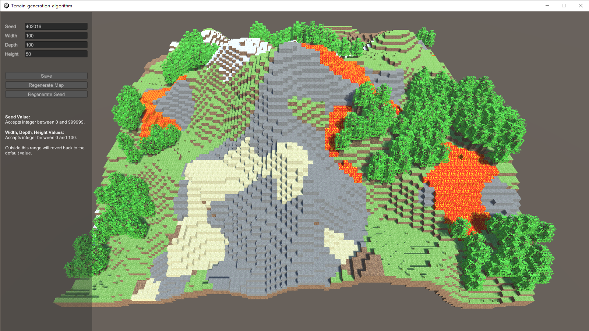

# MinecraftGenAlg

This is a Unity demo that generates Minecraft-like terrain using Simplex Noise algorithm

[Demo](https://github.com/i-miss-old-mmorpg/MinecraftGenAlg/releases/tag/v0.1)

## Screenshot

## Configuration

- **Seed Value:** Accepts any integer between 0 and 999999. Any values outside this range will revert back to the default value.
- **Width, Depth, Height Values:** Accepts any integer between 0 and 100. If a value exceeds this range, it will also revert back to the default value.

## WIP

1. Generation of Villages and Buildings
2. Generation of Water Flow
3. Generation of more complex terrains such as Caves, Mesas, etc.

## Reference

This project draws theoretical understanding from the "Making maps with noise functions" article by Red Blob Games. 

[Red Blob Games: Making maps with noise functions](https://www.redblobgames.com/maps/terrain-from-noise/)

